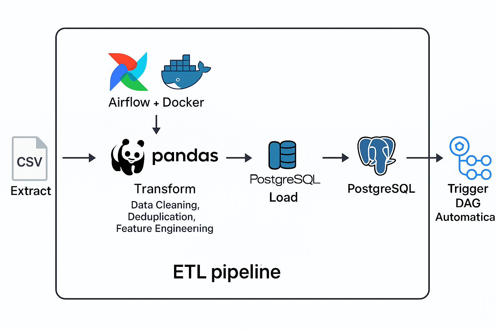
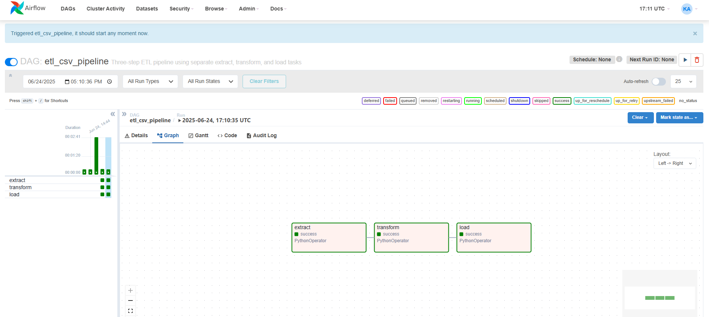

# Forbes ETL Data Pipeline Project 🚀

Welcome to the **Forbes ETL Data Pipeline** project! This repository showcases a fully automated ETL (Extract, Transform, Load) pipeline built with **Apache Airflow**, **Docker**, **PostgreSQL**, and **GitHub Actions**.

Designed as a **professional data engineering project**, it processes raw CSV data from the Forbes Billionaires list (2002–2023), cleans and transforms it, and loads it into a PostgreSQL database. CI/CD workflows ensure automated testing and deployment of the pipeline.

---

## 🏗️ Project Architecture

The entire workflow is containerized and orchestrated with Airflow and Docker. Here's a high-level architecture:



* **CSV File (Raw Source)** ➔ Local file
* **Airflow (Docker)** handles task orchestration
* **Python Operators** perform:

  * `extract()`: Read the raw CSV file
  * `transform()`: Clean, validate, enrich, and structure the data
  * `load()`: Write to both a new CSV and a PostgreSQL database
* **PostgreSQL (Docker)** stores the cleaned dataset
* **GitHub Actions CI/CD** validates code and transformation logic automatically

---

## 📊 Live DAG Run Screenshot (Airflow UI)

Below is a real execution from the Airflow UI showing a successful DAG run for the ETL pipeline:



---

## 💡 Key Features

* ✅ **Fully Automated Pipeline** using Apache Airflow
* ✅ **Containerized Development** using Docker Compose
* ✅ **Modular Python Code** with separate `extract.py`, `transform.py`, `load.py`
* ✅ **Data Cleaning & Transformation**:

  * Dropping duplicates per person/year
  * Handling inconsistent data formats
  * Fixing specific outlier values manually
  * Ranking billionaires yearly (SQL RANK equivalent)
* ✅ **PostgreSQL Integration** with SQLAlchemy
* ✅ **CI/CD with GitHub Actions**: Auto-test transformation logic using `pytest`

---

## 🏑️ Tech Stack

| Tool               | Purpose                               |
| ------------------ | ------------------------------------- |
| **Apache Airflow** | DAG orchestration (ETL pipeline)      |
| **Docker**         | Containerized environment setup       |
| **PostgreSQL**     | Target database for cleaned data      |
| **Pandas**         | Data manipulation and transformation  |
| **SQLAlchemy**     | Database connectivity (ORM)           |
| **GitHub Actions** | CI/CD: test pipeline & transformation |
| **pytest**         | Unit test for transformation logic    |

---

## 📂 Repository Structure

```
forbes-data-pipeline/
├── dags/
│   ├── etl_csv_pipeline.py     # Main DAG
│   ├── extract.py               # Extract logic
│   ├── transform.py             # Transform logic
│   └── load.py                  # Load logic
├── data/
│   ├── input.csv               # Raw Forbes data
│   └── output.csv              # Cleaned output
├── tests/
│   └── test_transform.py        # CI unit tests
├── .github/
│   └── workflows/
│       └── ci-cd.yml             # GitHub Actions 
├── assets/
│ ├── Airflow.png               # Airflow pipeline diagram
│ └── Project_Architecture.png  # Project architecture 
workflow
├── docker-compose.yml              # Airflow & PostgreSQL services
├── requirements.txt               # Python dependencies
└── README.md
```

---

## 🚀 CI/CD Pipeline (GitHub Actions)

GitHub Actions is set up to:

* Install dependencies
* Run `pytest` on `transform.py`

Sample step:

```yaml
- name: Trigger DAG
  run: docker exec airflow-webserver airflow dags trigger etl_csv_pipeline
```

This helps verify that your DAGs run properly **before deployment**, boosting reliability and confidence.

---

## 🥇 Results and Outcomes

* ✅ A fully functional and clean dataset stored in a production-grade Postgres database
* ✅ All stages of the pipeline are modular, reusable, and testable
* ✅ CI/CD integrated to automate testing and ensure code quality
* ✅ Easy to extend and deploy in larger data engineering systems

---

## 🙌 About Me

I'm **Ahmed Ahmed Khamis**, a passionate **Data Engineer** and **BI Developer**. I build pipelines that are not just functional, but production-ready, automated, and cleanly documented. Connect with me here:

[](https://linkedin.com/in/ahmed-khamis221)

---

## 🗳️ License

This project is licensed under the [MIT License](LICENSE). Free to use and modify.

---

## 🌟 Closing Thoughts

This project demonstrates real-world skills in:

* Data pipeline design
* Airflow orchestration
* Python-based ETL development
* CI/CD workflows using GitHub Actions
* Professional code organization

> "Data Engineering isn’t about dumping data, it's about creating reliable pipelines that empower data-driven decisions."

